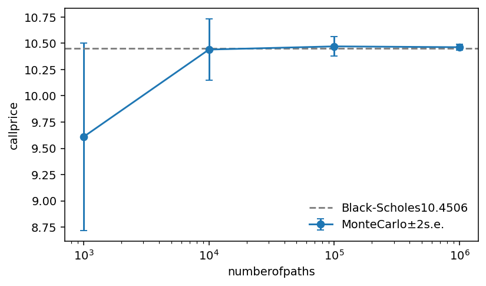

# Monte Carlo price of a European call

- **Date:** 2026-10-08
- **Author:** Weronika Jaszkiewicz
- **Code:** commit `041b6c5`

## Goal
Checkthe MonteCarlo estimator of a European call against the eBlack-Scholes price,and see how its error behaves as the number of paths grows.
## Method
$S_0=K=100$,$r=0.05$,$\sigma =0.2$,$T=1$
Exact simulation of

$$
S_T=S_0 \exp\bigl((r-\tfrac12\sigma^2)T+\sigma\sqrt{T}\,Z\bigr),\qquadZ\simN
(0,1),
$$

price estimated by the mean of $n$ discounted payoffs,standard error $\hats/\sqrt{n}$.

## Code and runs
`python experiments/mc_call/run.py base` (configuration `configs/base.yaml`:
$n$ from $10^3$ to $10^6$,seed 1).

## Results

Black-Scholes price:10.4506.
| n_paths | price | se | error |
|---:|---:|---:|---:|
| 1000 | 9.6101 | 0.4462 | -0.8405 |
| 10000 | 10.4408 | 0.1470 | -0.0098 |
| 100000 | 10.4711 | 0.0464 | +0.0206 |
| 1000000 | 10.4632 | 0.0147 | +0.0126 |

## Interpretation
Thestandard error falls like $1/\sqrt{n}$ (by about 3.2 for each ten fold increase of $n$). All errors are within 2s.e.(thelargest,at $n=1000$,
is 1.9 s.e.): consistent with an unbiased estimator.

## Next steps
Reduce the varianc ewith antithetic variates and compare the standard errors.

